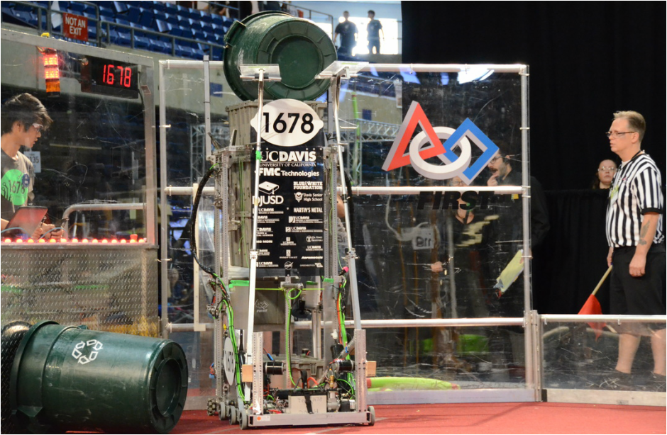

In [part one](/posts/intro-to-control-part-one-pid) of my series on control theory, I briefly mentioned PID tuning. PID tuning is the process of finding gains for your PID loop that provide a response that's good enough. There are many different ways to tune a PID loop, but before we go into them, let's talk about what the values that we're changing actually represent!

In this case, we'll continue to use the example of an elevator, but we'll make it a specific elevator - the elevator on [1678](http://www.citruscircuits.org/)'s world champion 2015 robot - Lemon Drop:

Lemon Drop's elevator had a travel of around 1.3 meters, and was powered by [2 MiniCIM](http://motors.vex.com/mini-cim-motor) motors with a 10:1 gear ratio.

This means that the input will go from -12 volts to 12 volts, which will cause the output (measured in meters) to change.

Recall that the PID equation looks like this:

\\[ u = (gain\_{p} \times e) + (gain\_{i} \times \int\_0^t e)  - (gain\_{d} \times \frac{d\_{e}}{d\_{t}}) \\]

We know that our output, \\(u\\) is measured in volts, and our error, \\(e\\) is measured in meters. Let's look at just the proportional part to make this simpler:

\\[ u = (gain\_{p} \times e) \\]

If \\(u\\) is measured in volts, and \\(e\\) in meters, than what unit must gainp be in? The answer is \\(\frac{\text{volts}}{\text{meter}}\\).

Why? Well the math checks out if we substitute units in for the variables in the equation:

\\[ \text{volts} = \frac{\text{volts}}{\text{meter}} \times \text{meters} \\]

Therefore, \\(gain\_{p}\\) is measured in \\(\frac{\text{volts}}{\text{meter}}\\). But what does it represent? Well, the way that I think about it is that the \\(gain\_{p}\\) value is when we will start slowing down. For example, in our elevator system, we are giving ±12 volts to the motors, so if \\(gain\_{p} = 12\\), then the elevator will be one meter away from it's goal before it starts to slow down.

In this case, I know that the elevator will come to a stop very easily, as the carriage has little mass, so a value of \\(gain\_{p} = 100\\) may be reasonable. Let's do the math:

\\[ u = (gain\_{p} \times e) \\]

And \\(gain\_{p} = 100\\):

\\[ u = (100 \times e) \\]

We want to know when the output is at exactly 12 volts, because that's where it'll start slowing down:

\\[ 12 = (100 \times e) \\]

Thus \\(e = 0.12\\)

when we start to slow down. This about matches what I would expect from this system, so 100 is a good P value to start with.

We can also calculate the units for \\(gain\_{d}\\) and \\(gain\_{i}\\) easily. This gives us the generic units of:

\\[ gain\_{p} = \frac{\text{input unit}}{\text{output unit}} \\]

\\[ gain\_{i} = \frac{\text{input unit}}{\text{output unit} \times \text{sec}} \\]

\\[ gain\_{d} = \frac{\text{input unit}}{\text{output unit} / \text{sec}} \\]

You can think of these in a similar way - for example, when choosing a \\(gain\_{i}\\), think about how far off it would need to be, and for how long, in order to require a maximum input. Thinking about PID gains in this way allows for a pretty good guess of what the gains will need to be on the first try.

Now, how do you actually select your gains? There are many different methods, but I go through the following steps, running the loop with many different values and graphing the output and input vs time at each step.

* Set I and D to zero. Set P to a conservative value.
* Increase P until you have oscillations (meaning that it is switching back and forth between having positive and negative error)
* Increase D until the oscillations stop.
* If there's steady state error (meaning that the goal is never reached), increase I until you reach the goal in time. You may need to decrease P or increase D after you add I.

Note that not all systems will need I or D! In general, systems with a lot of friction need less/no D and more I, and systems with very low friction are the opposite. Every system will be different, but as you tune more PID loops you'll start to get a feel for how to tune things.

Here's an example of how changing PID parameters effects the response of the system:

Here's an interactive demo! This is based on the elevator example from the previous post. Choose the PID values that you want, and the graph of position over time is instantly updated!



Hopefully that gives you an idea of what changing PID values will do to the response! You might notice that it's really hard to get integral to work right and not wind up too much (although it can be done). I'll cover ways to reduce that issue (and ways to control systems that don't have that problem!) in other posts.

That's all for now!
