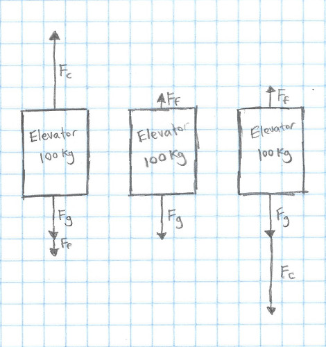

_Note: This post will assume some prior knowledge of physics. If you've taken a high school level physics class, you should be fine. If not, be prepared to do a bit of Googling :)_

Say you're developing a control system for a self-driving car, or a airplane (or almost anything). You want to be really, _really_ sure that when you try it out for the first time, it'll work. How do you make sure that that's the case?

The simple answer is to test all of your code in simulation before it ever touches actual hardware.  Test driven development is catching on in pretty much every major company, because people have learned that testing saves time and money - even if you're just writing an app or a website. So when running the wrong code results in breaking physical machinery that can cost hundreds or thousands of dollars, it makes even more sense to test in simulation. But how do you go about testing your controls code?

There are basically two steps:

1. Create a model of your system
2. Run your code on that model

It can be hard to know where to start on modeling your system though. Because of that, we'll go through the process of modeling simple elevator from [Part 1](/posts/intro-to-control-part-one-pid).

Let's get right into it!

This is the simulation from part one - this is rather easy to model, since it isn't designed to model a real system - I got to decide exactly what it would be. Still, I decided to make it a reasonable system that modeled something that you might see in the real world:

* It had a mass of 100 kg
* Friction causes it to be dampened by 10 Ns/m.
* The input was a direct force on the elevator, ranging from -5000 Newtons to 5000 Newtons (This was normalized to -1.0 to 1.0 in the code)
* Gravity is 9.8 \\(m/s^2\\)

First, let's make a [free body diagram](https://en.wikipedia.org/wiki/Free_body_diagram) to help understand the situation! Here's a FBD for full force upwards, applying no force, and full force downwards:



Here, \\(F\_{g}\\) is the force of gravity, \\(F\_{c}\\) is the control force that we are applying, and \\(F\_{f}\\) is the force due to friction. I will use \\( m \\) as the mass of the elevator. Using these numbers, we can describe the system with the following equation:

\\[ \ddot{x} = \frac{F\_{c}}{m} - F\_{f} - A\_{g} \\]

Here, \\(\ddot{x}\\) is the second derivative of the elevator's position, also known as it's acceleration. We use \\(A\_{g}\\) to describe the acceleration due to gravity.

We get the \\(\frac{F\_{c}}{m}\\) from the equation \\(\text{Force} = \text{Mass} \times \text{Acceleration}\\), or \\(F = ma\\), which we rearrange as \\(a = \frac{F}{m}\\).

Next, we'll figure out what effect friction has.

\\[ \ddot{x} = \frac{F\_{c}}{m} - \frac{d}{m} \times \dot{x} - A\_{g} \\]

In this case, \\( d \\) is the "damping coefficent" - The 10 Ns/m in our list above.

We can replace these with the actual constants, getting the equation:

\\[ \ddot{x} = \frac{F\_{c}}{100\text{kg}} - \frac{10\text{Ns/m}}{100\text{kg}} \times \dot{x} - 9.8\text{m}/\text{s}^2 \\]

\\(F\_{c}\\) is more frequently called \\(u\\), which can give us:

\\[ \ddot{x} = \frac{u}{100\text{kg}} - \frac{10\text{Ns/m}}{100\text{kg}} \times \dot{x} - 9.8\text{m}/\text{s}^2 \\]

Thus we can simulate our elevator's acceleration (and thus it's velocity and position as well) with that equation. This equation is often called a _second-order differential equation_, becaues it has a second derivative in it (the \\(\ddot{x}\\), or acceleration).

We can easily translate this into code as well:

```javascript
function setForce(force){
  this.elevator.xddot = (force / this.elevator.mass) - (this.elevator.ff / this.elevator.mass * this.elevator.xdot) - this.elevator.fg;
},
```

This is exactly the code that was used in the previous two posts to do the simulation!

Now, we can write a function to run PID control, and use that same function to first test it in our simulation, and then run the actual system.
