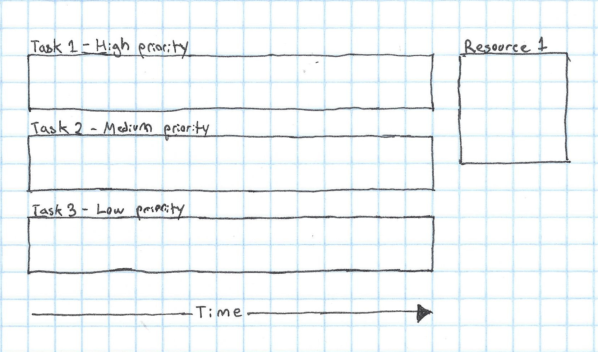
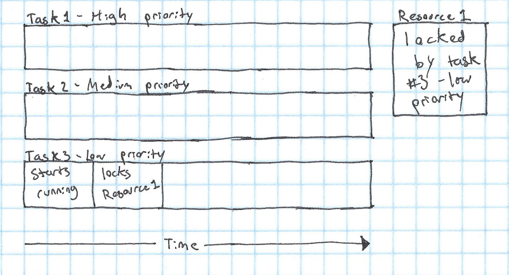
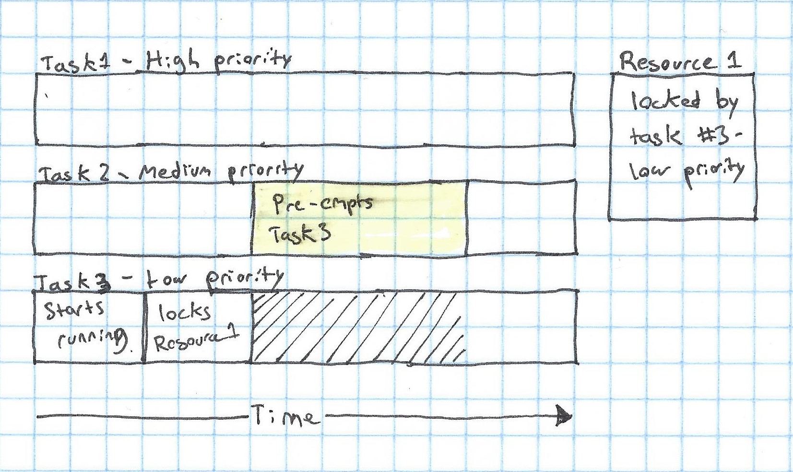
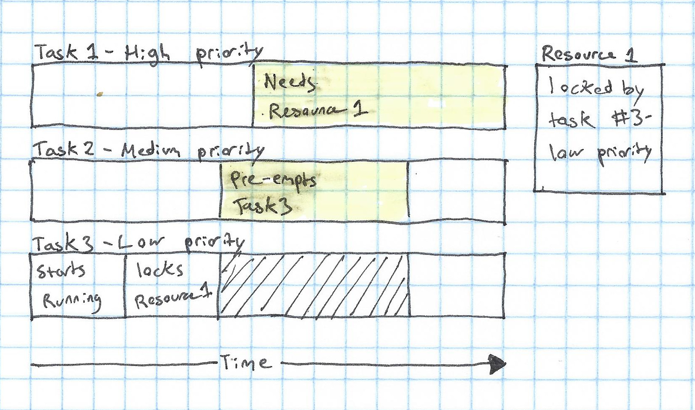
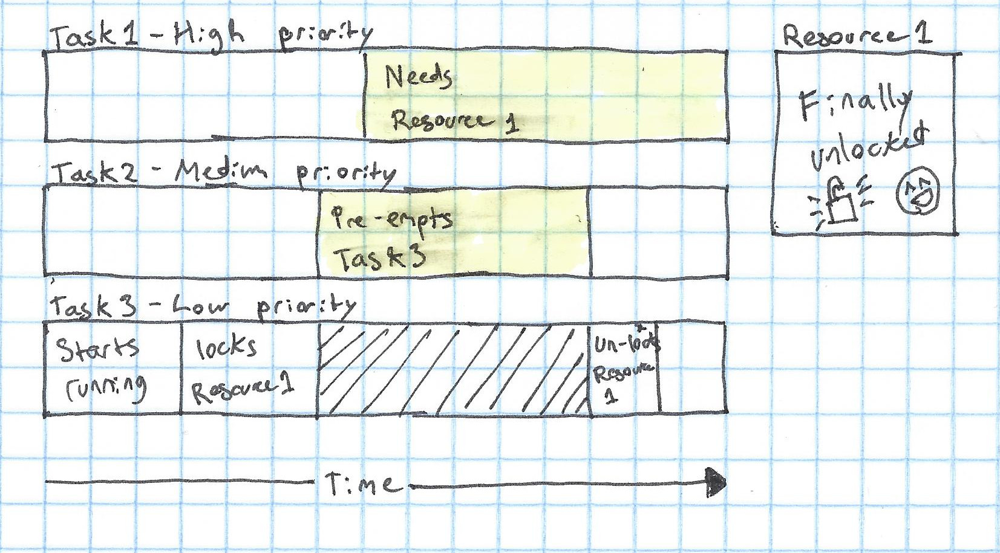
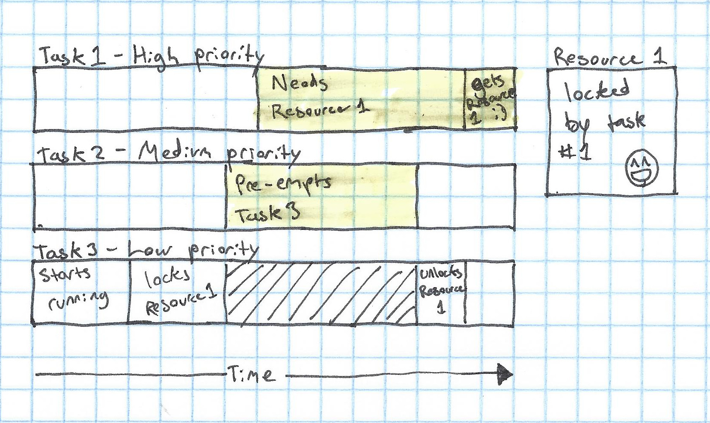

When I'm [programming robots](http://www.citruscircuits.org/), something that often comes up is "realtime" code. What does code being realtime mean? Simply put, realtime code has a known upper bound on the amount of time that it can take to execute. That rules out quite a few things:

* Any operation involving the network
* Any operation involving reading or writing files
* Any operation that allocates memory

And those are just a few of the things that will make code non realtime.

We use Linux for our code, so we end up using what's called the [RT-PREEMPT](https://rt.wiki.kernel.org/index.php/Main_Page) patch. This makes it possible for userspace programs to be realtime in Linux. The main thing that this changes is Linux's _schedluer_. The scheduler's job is to choose when to run which thread, and which program. In order to figure out why RT-PREEMPT changes the scheduler, let's look at how Linux's default scheduler compares to the RT-PREEMPT scheduler:

Default ([CFS](https://en.wikipedia.org/wiki/Completely_Fair_Scheduler)):

* Prioritizes giving all tasks equal run time
* Runs in O(log N) time, where N is the number of tasks
* No task is higher priority than another

RT-PREEMPT:

* Prioritizes running higher-priority tasks first
* All realtime tasks have a priority
* High-priority tasks can "pre-empt" lower priority tasks and run instead of them

As you can tell, CFS focuses on more general systems, while RT-PREEMPT focuses on letting specific tasks meet strict timing requirements. This is important, for example, when we have a thread that runs a controller for a robot, which we need to run at _exactly_ 200Hz.

However, there are a few problems that can come with this scheduling system. The main problem is priority inversion. To give an example of priority inversion, let's consider a simple pre-emptive scheduler:

* Every task has a priority
* A high priority task can choose to "pre-empt" a lower priority task, and run instead of it
* If a task needs a resource that only one task can access at a time, it will lock it with a mutex, so no other task can use it

Now, let's imagine how a system that uses this scheduler could go wrong.

We'll have three tasks: one high priority task, one medium priority task, and one low priority task. We also have one shared resource, which can only be used by one task at a time:

Next, Task 3, which is low priority, will start to run and will acquire a lock on Resource 1, meaning that no other tasks can use it:

Next, Task 2, which is medium priority enters a section of the code that needs to be realtime (called a _critical section_). This pre-empts Task 1, but Task 1 **still has a lock on the resource**.

Now, Task 1 - the highest priority task in the system - enters a critical section which needs to use the resource. It can't use the resource, because Task 1 has a lock on the resource, and it can't pre-empt other tasks, because it needs the resource to run it's code! Task 3, the task that has the lock, can't do anything about this though, because it's being pre-empted by Task 2 😢

Finally, once Task 2 is done doing it's thing, Task 1 can resume running and finish with the resource:

And Task 1 can finally have the resource and run:

So that's how a high priority task can be blocked by a lower priority task that doesn't need a resource. This is one of the main problems with the scheduler that I've described (called "Fixed priority pre-emptive scheduling").

So how do you fix this problem?

As it turns out, it's fairly simple - in order to release the lock, our low priority task has to have at least the same priority as the medium priority task that's pre-empting it. The way that the RT-PREEMPT Linux patch does this is by setting the priority of a task that has a lock on a resource to the priority of the highest-priority task that's waiting for that resource. In our example, that would mean that as soon as Task 1 wanted the resource, Task 3 would be set to high priority, and pre-empt Task 2, allowing it to finish with the resource and allow Task 1 to run as soon as possible.

This is a easy solution that will fix the priority inversion issue!

I hope that this has been a good intro to what priority inversion is, why it's a problem, and how to it's fixed. It definitely gave me some ideas as to things that I could research in the future:

* How does CFS work?
* How does the RT-PREEMPT scheduler work (in more detail)?
* Are there other ways to fix priority inversion?

All could be good topics for a future post.

Anyway, that's all for now!
