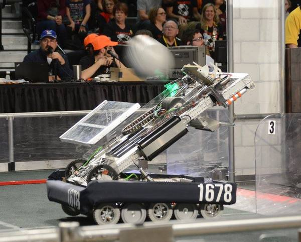
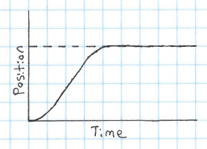
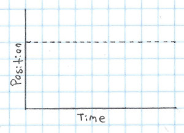
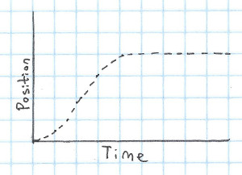
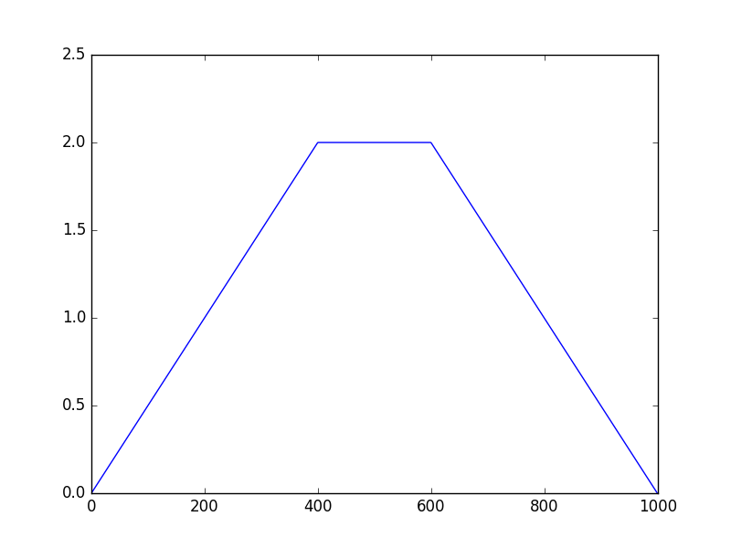
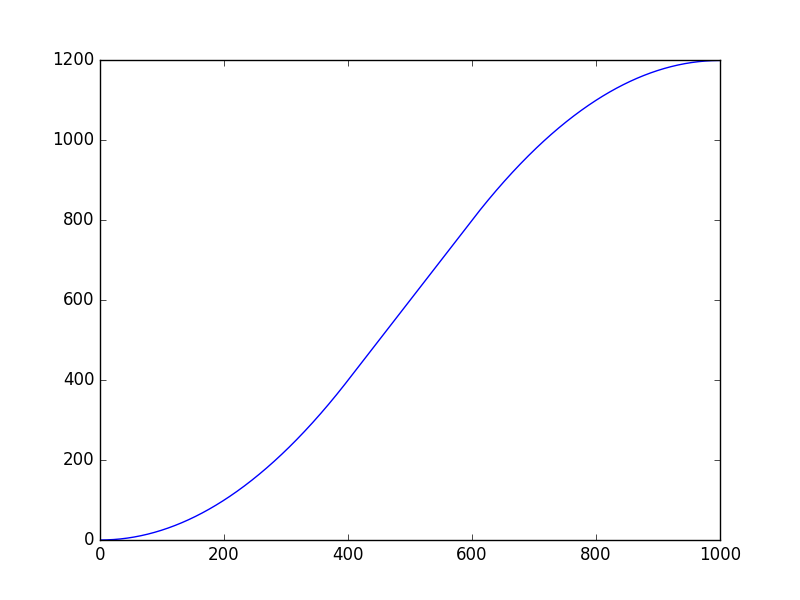

Most of the posts in this series have focused on feed-back control - using values from sensors to determine the output. This post will cover "feed-forward" control - controlling systems without using sensors. At first glance, this may seem silly - trying to control something without knowing it's position. However, it can actually be very useful!

Let's return, once again, to our example of the elevator. Back when we converted it into state space form, we ran into an issue with gravity - gravity made the system non-linear, which made it very difficult to model! But our troubles with gravity began before state space - the reason that our PID controller needed an integral term was to counteract gravity, but getting the integral term to play nice was almost impossible! How can feed-forward help us here?

Well, gravity will constantly accelerate the elevator downwards at \\(9.8 m/s^2\\). We know that \\(F = ma\\), and our elevator has a mass of 100kg, so gravity will apply a downwards force of 980 Newtons. If we apply a control force of 980 Newtons upwards, we will exactly cancel out the effects of gravity! This is called "feedforward", because you are applying the 980 Newton force regardless of the values of your sensors.

Not only does this make our state space model accurate, it also eliminates the need for integral control! Let's try it out:

(The force is now outputted in Newtons, capped from -5000 to 5000, so the gains are much larger)



So that's feedforward in a nutshell! It's often used for cancelling out the effects of gravity (or another force). Another example of cancelling out gravity is in a robot that I worked on on [Citrus Circuits](http://citruscircuits.org/) - Adrian:

Adrian had an arm that we wanted to rotate to a specific angle for shooting. Normally, this would be a non-linear system - The arm was being pulled down by gravity by different amounts depending on it's angle. We knew from modeling the system that the amount of force that was being applied would be proportional to the cosine of the angle of the arm, so we constantly would apply the voltage needed to keep the arm in position. This wasn't exactly feed-forward, since we needed to know where the arm was, but it's close enough that I lump it into the same category.

Anyway, with that explanation of feedforward out of the way, let's look at our integral term again. It can be very difficult to tune the integral part of a PID loop well - too low, and it does far too little, too high and it causes huge amounts of overshoot.

How can we fix this? Well, first, let's consider the integral term is getting so large - it's because the system isn't at the goal for a long period of time. This may seem obvious, but it's actually very important. The reason for that is that **we can directly control the value of the integral**! How? Read that sentence again - the system isn't _at the goal_ for a long period of time. We can control the goal, thus we have direct control over what the integral of the error is.

Now let's think about how changing the goal might help us - Here's what we've usually been doing:

In this graph, the dotted line is the goal and the solid line is the position. If you just look at the goal, it's clear that it's static over time:

What if instead of trying to jump right to the goal, we instead based it off what the system can actually do? That could look like this:

This is called "Motion Profiling", and it can really help make the response of our system! However, motion profiling gets even more powerful when you combine it with feed-forward. There are a few steps involved in this:

1. Decide what profile to use (essentially, how the goal will change over time)
2. Find the input that you need to apply to get it to follow that profile

The profile that I most commonly use is what's called a "trapezoidal motion profile", sometimes abbreviated "trap motion". A trapezoidal motion profile is a motion profile where the velocity follows a trapezoidal shape. It has a period where it accelerates, then once it reaches it's maximum velocity it stays there for some amount of time, and finally decelerates to a velocity of zero.

Here's what a graph of the target velocity could look like in a trapezoidal profile:

And here's what the position would look like for that profile:

(For completeness, [here's](https://gist.github.com/WesleyAC/861da6df9b172603536f8b01a9469e79) the script that I used to generate these graphs)

Ok, so now that we've decided to use a trapezoidal profile, what's next? Well, we need to decide how fast to accelerate and decelerate, as well as our maximum velocity. How do we decide on that? There are two ways: we can either use our model of the system to figure out the theoretical acceleration and maximum velocity, or we can measure it on the real system. I prefer to use the real system, since maximum acceleration and velocity are something that can be very off in some models (however, if you're developing a controller before you have access to the hardware, you may need to use the model instead). Anyway, here's how I find the values:

1. Give your system a maximum input and record the output. I usually save a CSV file.
2. Figure out where you've reached the maximum velocity. I do this by taking the derivative and finding where it levels off, but you can also just eyeball it.
3. Split the plot into an acceleration phase and a constant velocity phase (using the value you found in the previous step).
4. Run a [linear regression](https://en.wikipedia.org/wiki/Linear_regression) on the constant velocity phase, and a [quadratic regression](https://en.wikipedia.org/wiki/Polynomial_regression) on the acceleration. You can do this in matlab/octave, python (with numpy/scipy), or by hand (overlaying your guess onto the actual data until it looks right).

Once you've done that, the slope of your linear regression is the maximum velocity, and the squared value in your quadratic regression is the acceleration. Note that you'll want the acceleration and velocity values for the profile to be slightly less than the values that you got from the input. This is so that it can apply slightly more input if it isn't going as fast as it needs to.

That can all be somewhat hard to understand at first, so if you'd like to see code for it, you can look at Citrus Circuits' C++ code to do it [here](https://github.com/frc1678/muan/blob/master/control/trapezoidal_motion_profile.h) and [here](https://github.com/frc1678/muan/blob/master/control/trapezoidal_motion_profile.hpp). It's a bit ugly, it behaves correctly, and the [tests](https://github.com/frc1678/muan/blob/master/control/motion_profile_test.cpp) are all correct. Having tests when implementing this is really useful, as there are a lot of corner cases!

Now that you have your goal, you need to figure out what input to apply as feedforward. Just like figuring out the maximum velocity and acceleration, you can either do this on the system, or based on your model. Usually, the calculation of the feedforward part of the input will look like this:

\\[ u\_{ff} = C\_{a}\ddot{x\_g} + C\_{v}\dot{x\_g} \\]

Where \\(C\_a\\) and \\(C\_v\\) are constants and \\(x\_g\\) is the goal position from the motion profile (_not_ from the actual system). Let's try to find the \\(C\_a\\) and \\(C\_v\\) constants for our example elevator system! Remember, it's differential equation is as follows:

\\[ \ddot{x} = \frac{u}{m} - \frac{d}{m} \times \dot{x} - A\_{g} \\]

We can assume that we're using feedforward to cancel out gravity, so we will instead get this:

\\[ \ddot{x} = \frac{u}{m} - \frac{d}{m} \times \dot{x} \\]

We want \\(\ddot{x}\\) to equal \\(\ddot{x\_g}\\). If we replace \\(u\\) with our feed forward equation, we get the following equation:

\\[ \ddot{x\_g} = \frac{C\_{a}\ddot{x\_g} + C\_{v}\dot{x\_g}}{m} - \frac{d}{m} \times \dot{x} \\]

Which simply turns this into an algebra problem - solve for \\(C\_a\\) and \\(C\_v\\).

From this we find that \\(C\_a = m\\) and \\(C\_v = d\\).

So that's how you can find the \\(C\_a\\) and \\(C\_v\\) values from the system model. You can also just do this by changing the values and running the code on the actual system - I've found that that often gives much better results.

Anyways, that was a ton of math, so I'm going to give a TLDR/more intuitive explanation of motion profiling with feed forward:

What we've been doing in the past is setting our goal to a specific value, and having the PID loop deal with getting it there - however, this often causes problems, because we're asking our system to immediately jump to it's goal, which is impossible. We solve this by telling it to use a motion profile - smoothly moving the goal from the current position to the desired position. Once we choose our profile, we find the correct input to apply, which should, according to our model, cause it to follow the motion profile. We apply this feedforward input, which lets our PID loop only need to deal with correcting for small errors in the tracking of the motion profile.

That's motion profiling in a nutshell.

This can be hard to understand at first, so I'd recommend looking at the code that I linked above, or even implementing it yourself! You can learn a ton from implementing it. I would have a simulation of this, but if you do the feedforward correctly, the PID controller doesn't actually do anything, so it would be somewhat silly!

That's all for now!
