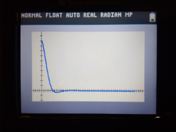

TI-Basic holds a special place in my heart - It's a terrible language on a terrible device, but I have fond memories of wasting time in my Algebra II/Trig class programming 2048, so that I could wast time in class doing something more fun than programming in TI-Basic! Recently, I remembered that my TI-84 supports matrices, and figured that it should be possible to get a [state-space simulation](/posts/intro-to-control-part-four-state-space) up and running on it pretty quickly.



(As an aside, that graph is the exact same thing as the matlab code from part four)

I figured that it would be easy, but I didn't expect it to be nearly as easy as it was! Within 8 lines of TI-Basic, I'd put together a program to simulate a closed-loop state-space system:

```tibasic
:ClrAllLists
:
:Input "DT> ",D
:Input "TIME> ",T
:
:For(I,1,T/D)
:((([A]-[B][E])[F])*D)+[F]→[F]
:I→L2(dim(L2)+1)
:[F](1,1)→L1(dim(L1)+1)
:End
```

`[F]` is the state, and `[E]` is the K-matrix (because TI-Basic doesn't let you use letters higher than J for matrices 😢).

Once the program is done running, the timestep and \\(x\_{1,1}\\) values are in L1 and L2, and can be graphed via statplot.

This isn't very useful for a few reasons:

* It's really really *really* slow. It can take around 30 seconds to simulate a simple system.
* Lists can only contain up to 999 values, so, for example if dt=0.01, you can only simulate for 9.99 seconds!
* It's way less convenient than tools like python or matlab/octave

Despite all that, it was fun to make, and I was surprised that it worked as well as it did! This really shows how generic state space is - it's likely possible to implement a lot more that I did, since most of the techniques used in state-space are just simple matrix operations.
