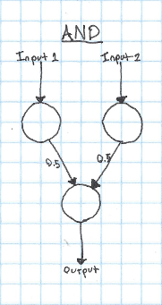
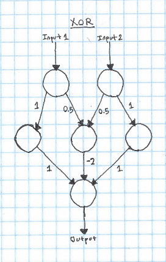

_Note: This accidentally got published before it was completed - this is a slightly modified version from what was originally published_

I've seen a lot of images trying to explain neural networks that look something like this:

But it's never been entirely clear to me what this is supposed to represent. I know that the circles are neurons, and the lines in between them connections between neurons, but how exactly would one go about implementing this in code, and what is the process to "train" a neural network?

In this post, I'll go into what exactly that image above is trying to show, and demonstrate how we can use a much simpler network to compute XOR.

First off, what is the point of a neural network? At the simplest level, all a neural network does is takes a list of numbers as an input, and outputs a list of numbers from it. As it turns out, the specific way that we calculate the output is really, really good at finding patterns in large amounts of data. In this post, I'll show you how to design neural networks to calculate logical functions like AND, OR, and XOR.

Now, let's get back to that diagram above. In this diagram, each circle is a "neuron". The job of a neuron is to take an input (the sum of all of the arrows pointing at it), apply an "activation function", and output the value returned from that activation function to all of the neurons on the layer below it. Each arrow has a "weight" - you multiply the input by this weight to get the output. The process of "training" a neural network is the process of finding the best weights to get it's results to match your data.

Let's take a look at a much simpler network. Here's a network that can calculate the logical AND function:

In this case, we'll say that our activation function is a step function - if the input to the neuron is greater than 0.5, it will output 1, otherwise it will output 0. Step functions aren't very useful for doing more complicated things with neural networks, but they're easy to reason about, so I'll use them for most of the examples in this post.

If both of our inputs are 1, both of the input neurons are activated. Since both of the input neurons are activated (outputting 1), they both add 0.5 to the input of the output neuron. Because the input to the output neuron is 1, the output neuron is activated. This is correct, since `1 AND 1 == 1`. If only a single neuron is activated, the input to the output neuron will only be 0.5, so it will not trigger.

It's pretty trivial to take this kind of network and apply it to OR instead of AND. We just need to change a few weights:

Now if either input neruon is activated, the output will be activated.

Think for a bit about how you would implement XOR with a system like this. As a reminder, here's the truth table for XOR:

| Input 1 | Input 2 | Output |
|:-------:|:-------:|:------:|
| 1       | 1       | 0      |
| 0       | 0       | 0      |
| 1       | 0       | 1      |
| 0       | 1       | 1      |

To make a neural network that can learn XOR, we'll need to add a new layer. This layer is called a "hidden" layer, since it's only used in the intermediate calculation, instead of being the input or the output.

The way that this works is pretty simple - if just one of the inputs is 1, it will go through the hidden neuron and add 1 to the output. However, if both inputs are true, the hidden neuron in the center gets activated, which subtracts two from the output, leaving it at zero.

This is fundamentally how neural networks work. That said, there are a couple things that you'll need to change to go from this model to a "real" neural network:

### Activation function

We've been using a step function as our activation. This is simple, but can cause problems when we're trying to do more complicated things. The most commonly used activation is probably the [sigmoid](https://en.wikipedia.org/wiki/Sigmoid_function) or [ReLU](https://en.wikipedia.org/wiki/ReLU). The sigmoid function works well as an activation for a few reasons:

* It's continuous and differentiable. This makes training the network with gradient descent possible.
* It's easy to compute.
* It's output is in the range (0,1). This isn't required, but it's nice :)

However, recently, the ReLU has become more popular for most networks, since it seems to often give better results. However, both have their own benefits and drawbacks.

### Bias

In our examples so far, we've always wanted to have an input of zero result in an output of zero. However, what if this wasn't the case? The current setup that we have doesn't allow for a neuron with zero input to output anything other than zero! In order to fix this, we introduce a "bias". A bias is a neuron that always outputs 1, which is connected to every non-input neuron in the network. By adjusting the weights of the connections to the bias neuron, you can get a non-zero output from a zero input. Even if you want a zero input to result in a zero output, it's best to add a bias to your network - it will often result in better performance or faster training.

### Training

A topic that I didn't get into in this post is how to find the weights for the connections. While manually finding weights works for simple logical functions, it quickly becomes impossible with hundreds or thousands of neurons. Luckily, there are many ways to automatically train neural networks, which I'll discuss in future posts.

### Implementation

While it can sometimes be useful to think of neural networks as a network of neurons, as I've shown in this post. However, it's often better to think about neural networks on the level of layers. This is useful, since each layer can be represented as a matrix of weights. This makes it easy and fast to implement a network, since there are many optimized matrix implementations out there.
