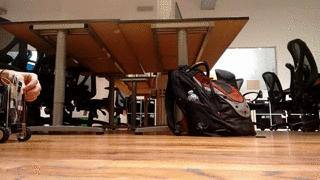

This week, I decided to build a robot:

It went pretty well, but there were definitely some things that I'd do differently if I were to do it again. This post will cover the full mechanical/electrical/programming details of the robot, as well as talking about improvements for the future.

Let's get right into the details - here's the full list of parts that I used:

* Arduino UNO
* Arduino Motor Shield
* Pololu micro gearmotors
* MPU6050 6-axis gyro+accelerometer
* 9v battery
* Decoupling capacitor
* Laser cut acrylic body
* Wheels

# Build process

The first part of the build process was sourcing components - almost all of the components were scavenged from the electronics shelf at the [Recurse Center](https://www.recurse.com/), but there were still a few things lacking: a sensor to measure the angle, and a body to put all of the components on.

For the sensor, I chose the [MPU6050](http://playground.arduino.cc/Main/MPU-6050). It's a cheap 6-axis accelerometer+gyro. It also allows running code to estimate orientation on the MPU6050 chip itself, so that the arduino (or other processor) doesn't have to run the calculations for that. Unfortunately, the manufacturer doesn't provide much documentation for this - there is however a reverse-engineered [open source implementation](https://www.i2cdevlib.com/devices/mpu6050) that works reasonably well.

Next, I needed some sort of base to attach the electronics and motors to. For this, I chose to laser cut acrylic. I used 3mm acrylic (the thinnest that I felt I could get away with). I was very happy with the speed and accuracy of laser cutting acrylic. It is slightly more brittle than I would like, but for this application it was fine, and it will definitely be my go to for small parts in the future.

# Electronics

The Arduino received power through a 9v battery plugged into the motor shield. I used a [decoupling capacitor](https://en.wikipedia.org/wiki/Decoupling_capacitor) across the leads of the battery to reduce noise that might effect the IMU. This was not an ideal setup, as the voltage drop in the battery caused significant differences in the response of the controller as the battery died.

The Motor Shield was also not an ideal solution - with the motors I was using, there was about a 15% deadzone where PWM was being applied but the motors did not move. This is a significant problem for a balancing robot, since it means that the only stable controller will have significant oscillations. I think switching to a better motor controller would help with this, and possibly better motors as well.

The setup for the IMU was fairly simple - it communicates over [I2C](https://en.wikipedia.org/wiki/I%C2%B2C), which is easy to set up. However, I did experience problems with significant oscillations causing the reading to drift. There are several things that I could think of that could cause this:

* The acceleration during the oscillations could be too much for the IMU to measure, causing drift.
* The current draw from the motors could be causing interference with the IMU (This hunch is why I added the filtering capacitor).
* There could be a bug in the motion processing firmware on the device. Sadly, it is closed source, so it would be very difficult to verify this.

Overall, the electrical system on the robot was the part that could use the most work - many of the components that I chose I chose because they were easily available or cheap, and not based on how suited for the job they were.

# Programming

The first step in programming the robot was to determine the orientation of the robot based off the readings from the accelerometer and gyroscope. I used the built in motion processing tools to do this, although I could have used the raw values and a [Kalman Filter](https://en.wikipedia.org/wiki/Kalman_filter) to get similar results.

Once I knew the angle, I found the offset that the robot would need to be able to be at to balance (theoretically this would be \\(\frac{\pi}{2}\\) radians, but since the center of gravity is not exactly in the middle, it's slightly different.

Once I knew the error from the target angle, I designed a simple [proportional-derivative](/posts/intro-to-control-part-one-pid) controller to keep the bot upright. While this worked, there are many improvements that could be made:

* The bot could automatically detect it's center of gravity
* I could use [LQR](https://en.wikipedia.org/wiki/Linear-quadratic_regulator) instead of PID
* I could allow for turning/more complicated paths in addition to position holding
* I could add some sort of remote control (Bluetooth, Wifi, RC, etc)

# Conclusion

This project was a lot of fun, and I was able to get it into a working state much quicker than I was expecting to - just 2 days. It's also given me a platform for experimenting with control systems in the future.
