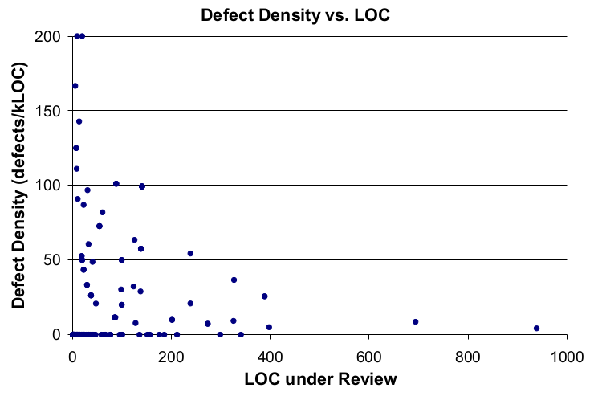

I saw an [article](https://medium.com/@9len/on-code-review-16ea85f7c585) today about code review. Included in it were a couple graphs purportedly coming from a study on code review. The author didn't refer to the graphs at all in the article, instead interleaving them with unrelated text as a sort of eye-candy.

These are the graphs in question:

I found these implausible, for several reasons:

1. The "Defects per kLOC" metric goes up to 800 in some cases - it strikes me as quite implausible that a code review would find 80% of the code in a PR to be wrong. And even if you look at 800 defects/kLOC as an outlier, the fact that most of the datapoints are > 200 defects/kLOC strikes me as surprising.
2. If you look at the two graphs provided, they're clearly from different datasets - many of the datapoints that exist on the first graph do not exist on the second one.
3. The lines that are drawn on the graph seem completely arbitrary - I'm used to seeing lines of best fit, but the red line on the "Defect Density vs. LOC" graph is clearly not showing a line of best fit - I'm not sure what I'm supposed to take away from this line.
4. If you look at the [blog post that these graphs are taken from](https://smartbear.com/learn/code-review/best-practices-for-peer-code-review/), it uses the "Defect Density vs. LOC" graph to make the claim that you should keep all of your reviews under 400 lines of code. However, there are only *two data points on the entire graph that are >400 LOC*, so it's impossible to make any sort of statistically significant claim about this.
5. Additionally, the datapoints that are at a defect density of zero are all under 200 LOC (With most of them clustered in the <100 LOC range). Given the way "defect density" is used in this study, a "defect density" of zero would indicate a complete failure of the reviewers to find issues[^1], and their analysis of the data says nothing about these points.

I found the claims being made off of this graph so unbelievable that I tracked down the initial study[^2] and decided to look into it.

There's a few things that immediately popped out at me - the first one is that the graph "Defect Density vs. LOC" graph is actually completely false - the reason that the 800 defects per kLOC figure popped out at me as being suspicious was because the scale is incorrect. Here's the real graph[^3]:

This shows about the amount of care that's put into these articles that cite this study, but let's carry on.

The next thing that popped out at me was the number of samples in the study. The [marketing page](https://smartbear.com/resources/case-studies/cisco-systems-collaborator/) for it claims that 2500 reviews were considered, but I definitely don't see 2500 datapoints on that graph - what happened? Reading the study, I found that since "defects" were a manually counted statistic, they took a SRS of 300 reviews, to reduce the amount of manual labour required. This is more reasonable, but it doesn't look to me like there are 300 datapoints in that graph - what gives? Luckily, they embedded the graph in the pdf in such a way that it's somewhat possible to recover the datapoints[^4]. In inkscape, I get a count of 213 points. I'm still curious where the other 87 went, but let's look at the ones that we have. Of the 213 points, 147 of them appear to have a defect density of zero (69%). Of these 147 points, 138 of them appear to have been changes that were ≤100 LOC (93%). This is interesting, because it appears to be directly in contradiction to the main claim of the paper and blog post[^5].

So in conclusion, we have a graph that's being passed around that:

1. Has its scale off by a factor of 4 from the actual data
2. Is not statistically significant to prove the claims that are being made about it
3. Even if it were significant, actually shows the exact opposite of what is being claimed

But, none of that matters, because it looks convincing enough at first glance, so it gets passed around and spread all over the internet. I am quite certain that the author of the blog post that I initially found using these images hadn't read the study that the graphs were pulled from. I don't think that this is unique to these images - I find that when I look at the actual studies that claims are pulled from, they are almost always [contradictory to the claims that are being made](https://danluu.com/dunning-kruger/), or have significant statistical issues. As a reader of these articles, I encourage you to think critically about the data being presented, find original sources to determine the methodology being used to collect data, and at the very least *double check that the graph that you're being show actually supports the claim that's being made*.

[^1]: In order for any of this data to be meaningful, you need to make the assumption that the actual number of defects/LOC is constant across different sizes of PRs.

[^2]: It's in a free ebook that can be found [here](http://www2.smartbear.com/Best_Kept_Secrets_eBook_2012.html) - you need to put in an email address to download it, but it's not checked - I used a disposable email service. The study starts on page 63 of the PDF.

[^3]: Interestingly, even with the correct scale, the two graphs still show different datasets - the "Defect Density vs. Inspection Rate" graph only has points with a defect rate of up to 150, but the "Defect Density vs LOC" graph has several datapoints near 200. I have not figured out why this is.

[^4]: I did this by importing the page into inkscape - each dot is a separate circle object

[^5]: To make this claim, I should really export the data properly and get a r² number for it. I'm too lazy to do this, but if someone else does, I'd be happy to link to it. It's worth noting that I actually think that the claims made by the study are true, for the most part - it's just that the data provided does not prove this.
