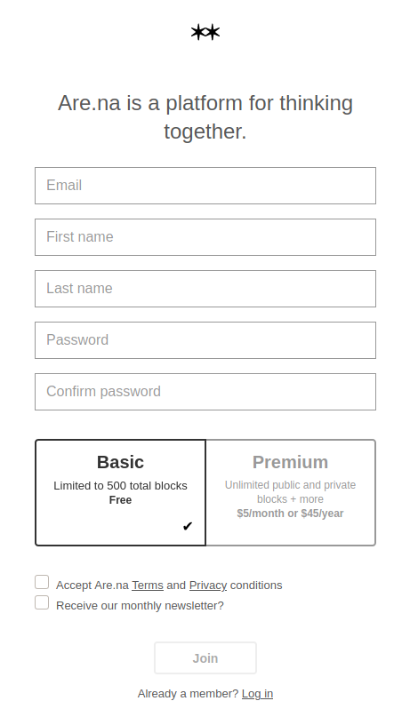

I signed up for [Are.na](https://www.are.na/) the other day, since apparently that's where all the cool hip designer kids hang out these days. Their signup flow and name system is a interesting case study in what not to do when making a schema to keep track of names.

When you sign up, you're asked for your first and last name. Off the bat, we're not doing so well — if you're [mononymous](https://en.wikipedia.org/wiki/Mononymous_person#Modern_times), or have more than two parts to your name, you're out of luck, better pick a last name quick. Many people are [legally mononymous](https://en.wikipedia.org/wiki/List_of_legally_mononymous_people), but far more choose to go by a single name in all aspects of their lives that don't require their government name — a category that pinterest for silicon valley hipsters surely falls into.

Once you've put in your first and last name, a url for your profile is automatically generated from it — for instance, "Wesley Aptekar-Cassels" turns into `are.na/wesley-aptekar-cassels`. This has a handful of problems: if your name does not consist of latin characters (conservatively, at least 1.5 billion people), or your name is not unique, or you want a username without a dash in it, or a username that's different from your display name, you're out of luck. Names that consist of non-latin characters cause the profile url to be a random string of letters and numbers, like `u9ewar2dcsy`. Making matters worse, if you change your name from one that consists of non-latin characters to a different name, and then change it back, the profile url will be different, breaking all of the old links to your profile forever.

It's possible to get around this by putting a unicode space character that isn't recognized by are.na as whitespace into the last name field, and putting a username in the first name field (as [I've done](https://www.are.na/wesleyac)), but while useful to know, that's hardly an excuse.

I've seen plenty of articles like [Falsehoods Programmers Believe About Names](https://www.kalzumeus.com/2010/06/17/falsehoods-programmers-believe-about-names/), but even the most basic stuff (names aren't all in a latin character set) keeps getting messed up. I recall seeing a comment on the post [Names, Legal Names, and Fractally Deferred Responsibility](https://nora.codes/post/names-legal-names-and-fractally-deferred-responsibility/) to the effect of "Why can't people just have one legal name, and go by that? Isn't that much easier?" Even ignoring the problems with forcing people to go by their legal name, this ignores the fact that millions of people have multiple legal names, since they exist in multiple legal systems (a Chinese or Russian name for one legal system, and English name for another, for instance). This is pretty basic stuff, if you think for a moment about the existence of other cultures and languages, and yet people keep fucking it up. And not just are.na — I can't pay with my credit card on Namecheap, because my last name contains an "invalid" character (a dash).

I reached out to are.na about this, and they said that they're aware that this is a problem and plan to fix it, which is good. But they wouldn't need to fix it if they'd just gone for the easy approach in the first place, and had a single "Name" field, allowing arbitrary unicode input. Names are legitimately hard, but getting the basics right isn't tricky, if you just stop for a moment to consider that not everyone's name looks like yours.
