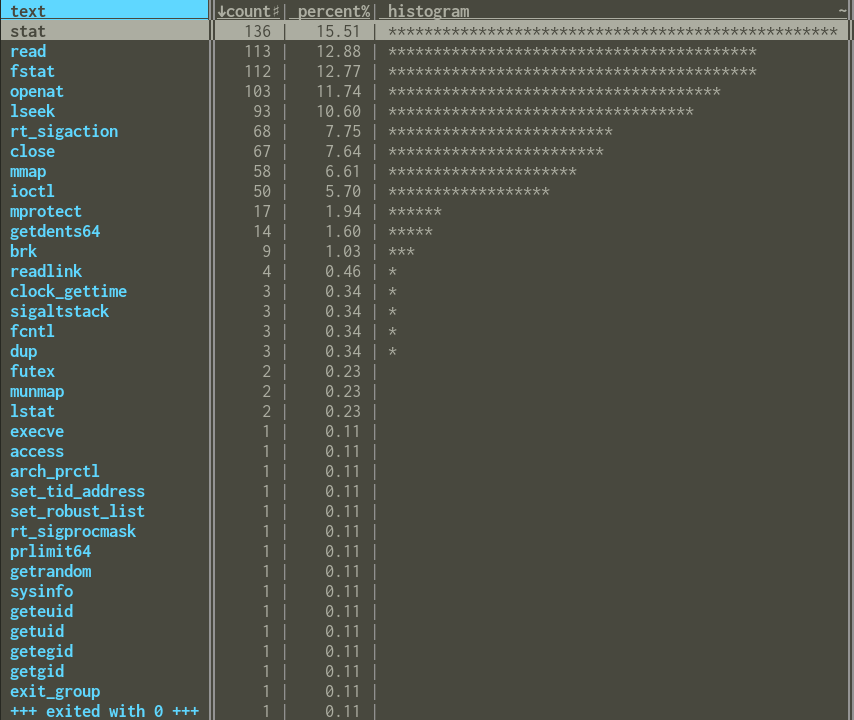

[Bert](http://somethingdoneright.net/) and I got talking this morning about Python startup time — Bert has a theory that batching `stat` calls via io_uring might lead to worthwhile interpreter startup time improvements.

In order to start validating that, we first wanted to see what system calls the python interpreter made. I made a blank python file:

```
touch /tmp/empty.py
```

And ran it with [`strace`](https://jvns.ca/blog/2015/04/14/strace-zine/):

```
strace python3 /tmp/empty.py 2> /tmp/empty.py.log
```

This gives us nearly 900 syscalls, which is a lot to manage by hand. After `grep`ping through it and poking at it in vim, I wanted to see a histogram. Luckily, [VisiData](https://www.visidata.org/) makes this easy:

```
cut -f1 -d"(" /tmp/empty.py.log | vd
```

That loads the data about which syscalls are being called (the `cut` command removes everything but the name of the syscall, so, for instance, all calls to `stat` look the same) into VisiData. Once I've done that, I can press `Shift`+`F` to get a histogram:

<center></center>

From that we can see that `stat` and `fstat` make up around 28% of the syscalls by volume, which makes them a potentially reasonable target for optimization. (After we were done with this, we used `perf` to get timing information, which seemed to confirm this hypothesis more)

I also did the same process for Ruby, just to see how similar it was:

<center></center>

It makes sense that Ruby is around 10x slower to start up in this case than Python, since it's doing many more system calls.

Overall, I've found VisiData to be a super valuable tool for quickly answering questions about datasets. Even if the only tool you know from it is to press `Shift`+`F` to get a histogram, that's already extremely useful[^1] — it took me less than a minute to go from not knowing anything about what syscalls the python interpreter used to seeing a histogram that confirmed some of our speculation.

[^1]: Unix neckbeards will likely point out that `cut -f1 -d"(" /tmp/empty.py.log | sort | uniq -c | sort -h` will work just as well, and they're correct. I use that sometimes as well, but I find that VisiData is usually quicker and allows me to dive into the data in more detail interactively if I want.
