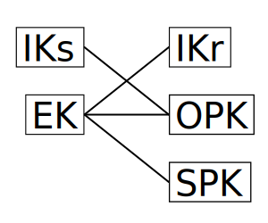

[Signal](https://signal.org/) uses a protocol called "[Extended Triple Diffie-Hellman](https://signal.org/docs/specifications/x3dh/)" (X3DH) for key agreement[^1]. This essentially takes standard [Diffie-Hellman key exchange](https://en.wikipedia.org/wiki/Diffie%E2%80%93Hellman_key_exchange), and enables it to be used where one party may be offline while they're receiving a message, while providing forward secrecy.

While the paper clearly explains how to implement X3DH, the *why* is slightly less clear. In this post, I'll briefly explain how X3DH works, then investigate what security property each of the steps involved is aimed at providing, and why particular choices were made around the signature algorithm.

## A quick summary of X3DH

(This summary requires a understanding of Diffie-Hellman key exchange — if you are unfamiliar or need a refresher, take a look at this footnote[^2])

In X3DH, the receiving party (who may be offline when they receive a message) uploads the following [Curve2519](https://en.wikipedia.org/wiki/Curve25519) public keys to a server:

* A identity key (`IK_r`)
* A "signed prekey" (`SPK`)
* A signature for `SPK` with `IK_r`
* A number of "one-time prekeys" (`OPK1`, `OPK2`, …)

When the sending party wants to send a message, they download from the server `IK`, `SPK`, the signature for `SPK`, and one of the one-time prekeys (which the server deletes and does not use for future runs).

The sender has two keys:

* A long-term identity key (`IK_s`)
* A ephemeral key used only for a single X3DH handshake (`EK`)

After validating the `SPK` signature is correct, the sender can generate a shared secret by invoking the Diffie-Hellman function four times:

* `DH(IK_s, SPK)`
* `DH(EK,   IK_r)`
* `DH(EK,   SPK)`
* `DH(EK,   OPKn)`

The outputs of these functions are concatenated and run through a key derivation function to generate a shared secret. If the server has run out of `OPK`s, only the first three functions are performed, to the slight detriment of the forward-secrecy properties. This image summarizes the Diffie-Hellman functions that are preformed:

## Why, though?

This is a lot of stuff, and it's understandable to ask what it's all doing. There are two basic properties that we want our key exchange to provide:

The first is "forward secrecy" — that is, if the private keys are compromised after the X3DH handshake has been completed, a attacker will not be able to decrypt the message. This is why we need the ephemeral key, and why we don't just do standard Diffie-Hellman with the identity keys and call it a day.

The second is "mutual authentication" — that is, both of the parties know the identity of the other party that they're talking to, and know that they are not being impersonated. This is why we want long-term identity keys — it's much simpler to prove ownership of a single long-term key than it is one of many ephemeral keys.

So, we want to use long-term keys for mutual authentication, and ephemeral keys for forward secrecy, and we can understand the one-time prekey as the ephemeral key for the receiving side. What's the signed prekey doing, then? It primarily serves as a backup, in case the server runs out of one-time prekeys. The signed prekey is replaced every time the client uploads new one-time prekeys, and thus is is more ephemeral than the identity key (which hangs around indefinitely), but not so ephemeral that we might run out.

So, that's the explanation for *why* we have each of these keys. Once we have that, it's actually pretty clear why we do the set of Diffie-Hellman operations we do. If we look at the case without a one-time prekey, it's very clear:

* We need to do a exchange between the ephemeral keys (`EK` and `SPK`), in order to get forward secrecy.
* We need to involve `IK_s` and `IK_r`, to provide mutual authentication.
* We don't want to use `DH(IK_s, IK_r)`, because doing so does not provide any forward secrecy, and not doing so provides better deniability (since anyone could forge a convincing looking transcript of a X3DH session without knowing either of the identity private keys, by generating all the ephemeral keys themselves)

With those constraints, we end up with the only thing we can have:

However, the case where we do have a one-time prekey offers us more options. In particular, we could swap the roles of `SPK` and `OPK`, giving use either of these:

Signal chooses to take the somewhat simpler approach of keeping the role of `SPK` the same regardless of whether we have a `OPK`, just adding in `DH(EK, OPK)` in the case where `OPK` is available. While this has slightly worse forward secrecy properties on its own (the attacker can crack more of the DH outputs if they capture the `SPK` private key), this doesn't really matter, because the DH outputs are fed through a KDF anyways, which necessitates cracking all the DH outputs to capture the key[^3].

## On signatures

One thing we haven't talked about is the reason that the signature of `SPK` is needed. Here's the attack that's intended to prevent:

* Alice tries to send a message to Bob.
* The server replies with Bob's `IK`, but values of `SPK` and `OPK` that it generated for itself, and thus knows the private keys for.
* Alice sends a message. The server doesn't relay this to Bob (since he wouldn't be able to decrypt it), but instead holds on to it.
* Later, the attacker compromises Bob's `IK` private key. Now they can calculate the shared secret, and read the initial message.

Signing the `SPK` is a sensible way to prevent this. However, there are a few questions to ask about the particular way in which it's implemented in X3DH. Firstly: is it safe? Reusing keys for multiple purposes is can lead to disastrous results, and it's important to rigorously prove that any such construction is safe. My understanding is that most cryptographers believed this construction to be safe, but it was only [relatively recently that a actual proof for these specific algorithms was provided](https://eprint.iacr.org/2021/509.pdf) (and even then, I'm not entirely sure that the construction in that paper applies to X3DH, although I'd be quite surprised if it didn't).

The second question relates to how one even goes about using the same keypair for Diffie-Hellman and EdDSA signing. The [standard approach](https://github.com/netfoundry/libsodium-doc/tree/master/quickstart#how-can-i-sign-and-encrypt-using-the-same-key-pair) (other than "don't do that", which is generally recommended) is to take a EdDSA key (which is a point on a [Twisted Edwards curve](https://en.wikipedia.org/wiki/Twisted_Edwards_curve)) and convert it into X25519 key (which is a point on a [Montgomery curve](https://en.wikipedia.org/wiki/Montgomery_curve)). This is convenient, since a point on a Twisted Edwards curve maps to a single point on Montgomery curve, but notably, a point on a Montgomery curve maps to **two** points on a Twisted Edwards curve[^4].

Signal chooses to solve this by [defining a scheme called XEdDSA](https://signal.org/docs/specifications/xeddsa/), which specifies which of the two possible points to use.

One has to ask, though, why go through the effort, when you could just start with a Twisted Edwards curve? My guess is that the signature step wasn't added until Signal was already being deployed, so using Montgomery curves for identity would be a backwards incompatible change. My understanding it that Matrix uses Twisted Edwards curves from the start in their implementation of X3DH, which I think is quite sensible, given that they had the luxury of designing their protocol with Signal's hindsight.

This still raises the question of why they chose to use the same key at all — it's easy to imagine a system where the identity key is exclusively used for signing, and a separate (signed) key-exchange key is used. Given recent proofs of the security of composing EdDSA and X25519, I don't think there's any advantage to doing so at this point, and Signal probably didn't go down this path for the same reason that they needed to invent XEdDSA in the first place — they already had a bunch of Montgomery keys deployed, and didn't want to switch them out for Twisted Edwards keys.

[^1]: Well, they now use a [post-quantum secure version](https://signal.org/docs/specifications/pqxdh/), but it's a similar idea.
[^2]: Diffie-Hellman gives us a function `DH(private, public)` that takes a private key and a public key, and generates a secret value from them. Notably, two parties can each run the function with their own private key and the other party's public key, and they will both get the same value.
[^3]: Ideally don't be like [SimpleX](https://github.com/trailofbits/publications/blob/master/reviews/SimpleXChat.pdf) and accidentally forget to apply the KDF.
[^4]: This is what lead to [a fun vulnerability](https://monocypher.org/quality-assurance/disclosures) in the Monocypher library, where giving a all-zero signature would be considered valid for 50% of messages due to a incorrect internal conversion between the two forms.
